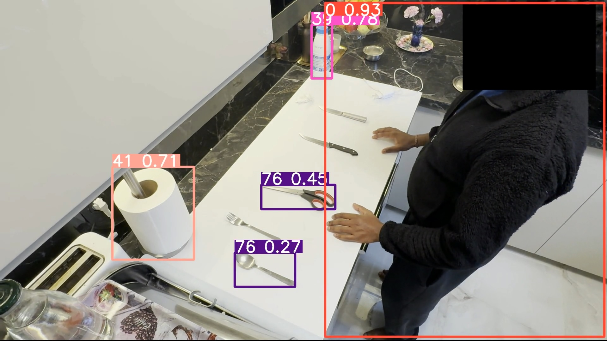
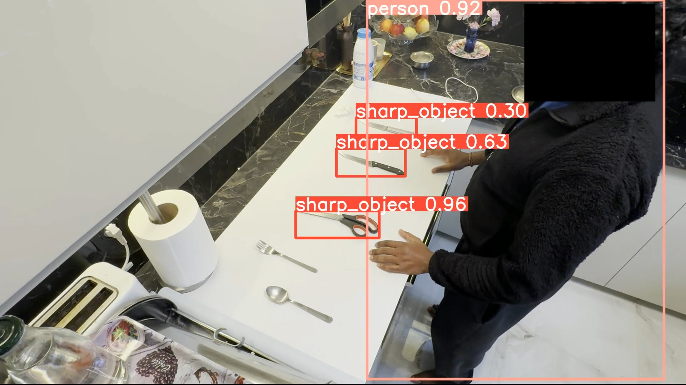

# Dangerous Object Detection with YOLOv10
Detecting sharp objects and persons in kitchen environments

## Overview

This project consists of three main steps:
1. Annotating the dataset using **CVAT Online**.  
2. Preparing the dataset locally using `training_dataset_preparation.ipynb`.  
3. Fine-tuning the YOLOv10 model on Google Colab using `finetuning_yolo.ipynb` with a T4 GPU.

Each step is designed to be run smoothly with specific setups, as detailed below.

---

## 1. Data Annotation with CVAT Online

**Objective**: Before preparing your dataset, you need to annotate your images using the **CVAT Online Tool**. CVAT (Computer Vision Annotation Tool) provides an easy-to-use web-based platform for annotating images and videos for computer-vision tasks, with no need to install anything.

### Steps
1. **Go to CVAT Online**  
   • Use the online version of CVAT at <https://cvat.org/>.  
   • Create an account or log in.

2. **Create a New Task**  
   • Upload your images directly to the platform.  
   • Set up a task for annotating objects (e.g., people, sharp objects) using bounding boxes.

3. **Annotate the Images**  
   • Use the bounding-box tool to mark the objects of interest.  
   • Ensure the labels correspond to your classes.

4. **Export the Annotations**  
   • After completing your annotations, export the dataset in **YOLO 1.1** format.  
   • Each image receives a `.txt` file containing class labels and normalized bounding-box coordinates.

5. **Download the Dataset**  
   • Download the annotated images and label files in YOLO 1.1 format—ready for the next step.

---

## 2. Dataset Preparation (`training_dataset_preparation.ipynb`)

**Objective**: This notebook helps you prepare the dataset required for training the YOLOv10 model. It handles formatting and augmentations to ensure your data is training-ready.

**How to Run**: Execute the notebook locally. Key steps include:  
- Organizing annotated images and labels in the standard YOLO folder structure.  
- Applying data augmentations with libraries such as Albumentations.

Be sure to install the required dependencies (e.g., OpenCV, Albumentations) on your machine.

---

## 3. Fine-Tuning YOLOv10 (`finetuning_yolo.ipynb`)

**Objective**: This notebook fine-tunes the YOLOv10n model on a custom dataset to improve detection accuracy—e.g., for sharp-object detection.

**How to Run**: The notebook is intended for **Google Colab** with a **T4 GPU**. Running locally without a dedicated GPU will be significantly slower.

### Google Colab Setup
1. **Ensure GPU is enabled**: In Colab, go to `Runtime > Change runtime type` and select **GPU** (preferably T4).
2. **Upload your dataset to Google Drive**: Make sure your dataset is compressed and stored in Google Drive for easy access during the training process.
3. **Custom Dataset Configuration**: Add the `custom_data.yaml` file into Google Drive and update it to point to the correct image and label paths in Google Drive.

---

### Important Notes
- **Custom Data Path**: Ensure paths in `custom_data.yaml` correctly reference `train` and `val` directories in Drive.  
- **Smooth Execution**: Verify dependencies and Google Drive authentication in Colab to avoid errors.  
- **Training Time**: About 45 minutes on a T4 GPU for 150 epochs; considerably longer on CPU.

---

## 4. Results & Insights

| Experiment | What We Did | Key Metrics (mAP@0.5 / F1, etc.) | Real-World Test | Take-away |
|------------|-------------|----------------------------------|-----------------|-----------|
| **Initial multi-environment fine-tune** | ~20 base photos (bedroom, living-room, kitchen) augmented × 10 → 220 images | mAP 0.951 (both classes). Confusion matrix: person 90 % correct, sharp-object 94 % correct but with cross-class confusion. | Missed many detections in unseen videos; struggled when objects were small. | High accuracy on static images ≠ good video generalisation. More data variety alone didn’t solve it. |
| **Single-environment fine-tune (kitchen only)** | Fixed-camera photos (≈ 40) + 5× augmentation → 240 images | Overall mAP ≈ 0.80. Person F1 ≈ 0.92; sharp-object accuracy ↑ to ≈ 81 %. | Stable detection of both classes in new kitchen video; big improvement over first model. | Consistent viewpoint + clearer objects trump sheer quantity. |
| **Advanced augmentation pass** | Added heavy rotations, shadows, rain, noise, coarse dropout | Person mAP 0.915; sharp-object classification ↓ to 44 % (F1 ≈ 0.60). | Model became over-sensitive—many false positives/negatives. | Aggressive, “realistic” augmentations can hurt if they no longer resemble deployment conditions. |

### Visual Comparison

Below is an example showing the same kitchen frame predicted with the **base YOLOv10 model** versus the **fine-tuned model**:

| Base YOLOv10 (pretrained) | Fine-tuned YOLOv10 |
|----------------------------|--------------------|
|  |  |

➡️ The base model often missed the sharp object, while the fine-tuned version consistently detects both the person and the object, reflecting the improvements captured in the metrics above.

### What Worked
- **Focus on environment consistency**: Training on images from the same camera angle and lighting made detection reliable in matching videos.  
- **Making small objects bigger & clearer**: Placing a white counter beneath knives/scissors improved sharp-object recall.  
- **Simple augmentations (flip, brightness/contrast)** provided enough variety without confusing the model.

### What Didn’t
- **Over-diversified data** in the first run reduced real-world accuracy—even though metrics looked great.  
- **Excessive augmentations** (strong rotations, heavy noise) introduced patterns not present in our target scenario, degrading sharp-object performance.

### Lessons Learned
1. **Quality > Quantity**: Relevant, well-framed images beat a larger but scattered dataset.  
2. **Augmentation should mimic deployment—not simulate every possibility.**  
3. **Evaluate on video early**: High validation mAP may hide generalisation gaps.  
4. **Iterate in small, measurable steps**: Each change (data, augmentation, hyper-parameters) should be isolated and tested.

### Next Steps
- Collect more kitchen-style images with varied utensils and lighting to boost sharp-object precision.  
- Experiment with YOLOv10s/m variants for a speed–accuracy trade-off.  
- Add proximity logic so the system can flag when a person’s hand comes within a risky distance of a sharp object.

---

By following these steps, you will be able to annotate your data using CVAT Online, prepare your dataset locally, and fine-tune the YOLOv10 model efficiently using Google Colab.
